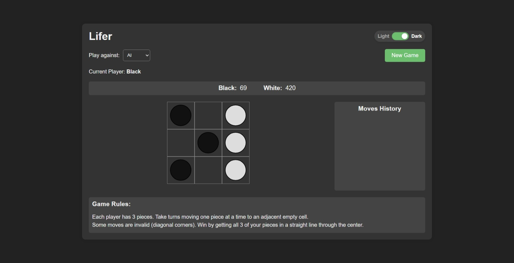

# Lifer



## [Play Lifer Now!](https://SimpNick6703.github.io/Lifer)

Lifer is an engaging strategy board game played on a 3x3 grid, combining elements of Tic-Tac-Toe and Chess. This implementation features both human vs. human and human vs. AI gameplay, with a sleek interface and dark mode support.

## Game Rules

- Each player has 3 pieces (black or white)
- Players take turns moving one piece at a time to an adjacent empty cell
- Pieces can move horizontally, vertically, or diagonally to any adjacent empty cell
- Some diagonal moves between corners are invalid (see the game UI for details)
- **Objective**: Get all 3 of your pieces in a straight line through the center

## Features

- Play against another human or an AI opponent
- Smart AI using minimax algorithm with alpha-beta pruning
- Dark/Light theme toggle with persistent user preference
- Responsive design for desktop and mobile play
- Smooth animations for piece movements
- Move history panel to track the game progress
- Score tracking across multiple games

## AI Implementation

The AI opponent uses the minimax algorithm with alpha-beta pruning, looking ahead 2 moves to determine the best strategy. The AI is competent but beatable, providing a nice challenge for both new and experienced players.

## Implementation Details

### Client-Side Version (GitHub Pages)
- Built with vanilla JavaScript, HTML, and CSS
- All game logic runs in the browser
- No server-side components
- Accessible at [https://SimpNick6703.github.io/Lifer](https://SimpNick6703.github.io/Lifer)

### Full-Stack Version
- Backend built with Flask and Python
- Game logic handled on the server
- WebSocket communication for real-time updates
- Same features as the client-side version

## Development Setup

### Running the Flask Version Locally

1. Clone the repository:
```bash
git clone https://github.com/SimpNick6703/Lifer.git
cd Lifer
```

2. Install the requirements:
```bash
pip install -r requirements.txt
```

3. Start the Flask server:
```bash
python app.py
```

4. Open your browser and navigate to `http://127.0.0.1:5000`

## License

This project is licensed under the MIT License - see the [LICENSE](LICENSE) file for details.

## Acknowledgements

- Inspired by classic strategy board games
- AI algorithm based on minimax with alpha-beta pruning
- UI design inspired by modern web applications

## Contact

For any queries or suggestions, please open an issue on this repository or contact via Discord with username `simpnick`.